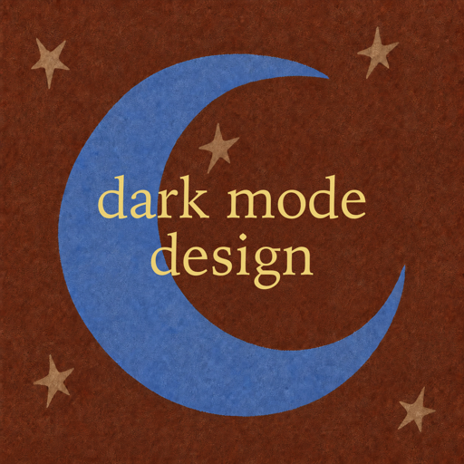
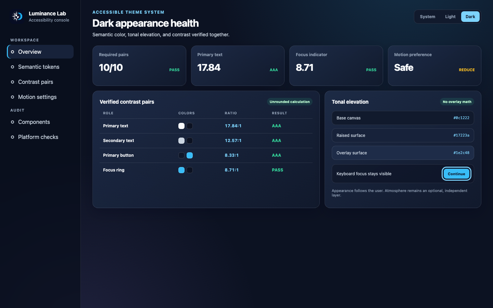

<p align="center">
  
</p>

<h1 align="center">Accessible Dark Mode Design Expert</h1>

<p align="center">
  Accessible light/dark theme design, implementation, review, and audit guidance for Codex and Claude Code.
</p>

<p align="center">
  <a href="#繁體中文">繁體中文</a> · <a href="#english">English</a>
</p>

<p align="center">
  <a href="https://github.com/dhosruiasn/accessible-dark-mode-design-expert/actions/workflows/validate.yml"></a>
  <a href="https://github.com/dhosruiasn/accessible-dark-mode-design-expert/releases"></a>
  <a href="LICENSE"></a>
</p>



## 繁體中文

### 這是什麼

這是一套供 OpenAI Codex 與 Claude Code 共用的 Agent Skill，用來設計、實作、審查與稽核可存取的 Light／Dark Theme 系統。內容涵蓋 Web、Apple Human Interface Guidelines、Material Design、WCAG 對比、語意色彩 token、主題初始化，以及動態效果偏好。

這個版本由公開的 `dark-mode-design-expert` 衍生並大幅重整；完整來源與授權說明請見 [NOTICE.md](NOTICE.md)。

### 主要能力

- 正確處理 System、Light、Dark 三種偏好與持久化設定
- 使用語意 token 建立表面、層級、文字、邊框與互動狀態
- 依 WCAG 計算文字與非文字對比，包含 alpha compositing
- 分辨 Material 2 overlay 與 Material 3 tonal elevation
- 依 Apple Dark Mode 指南處理動態顏色、圖片與系統外觀
- 避免頁面初始載入時閃爍錯誤主題
- 提供 `prefers-reduced-motion` 安全動畫範例
- 建立 route／surface／state 驗收清單，涵蓋登入、Portal、第三方與 responsive 狀態
- 盤點 raw color、主題轉場、SVG、pseudo-element、動畫與視覺效果候選
- 支援不覆蓋使用者外觀偏好的時間、天氣、天空與海洋 atmosphere
- 提供 Web、Apple、Material、裝置與無障礙設定稽核清單

### 內含工具

- `scripts/contrast-ratio.mjs`：無相依套件的 WCAG 對比計算器
- `scripts/test-contrast-ratio.mjs`：對比計算回歸測試
- `scripts/validate-skill.mjs`：Skill 結構與檔案驗證器
- `scripts/sync-installations.mjs`：Codex／Claude 安全同步與名稱遷移
- `scripts/test-sync-installations.mjs`：安裝、衝突保護與遷移回歸測試
- `scripts/theme-surface-inventory.mjs`：route／surface／state 審查前的 source-level 候選盤點器
- `scripts/test-theme-surface-inventory.mjs`：盤點器格式、忽略規則與 CLI 回歸測試

建議使用 Node.js 18 或以上版本。

### 安裝至 Codex 與 Claude Code

```bash
git clone https://github.com/dhosruiasn/accessible-dark-mode-design-expert.git
cd accessible-dark-mode-design-expert
node scripts/sync-installations.mjs --sync
```

安裝位置：

- Codex：`${CODEX_HOME}/skills/accessible-dark-mode-design-expert`，未設定 `CODEX_HOME` 時為 `~/.codex/skills/accessible-dark-mode-design-expert`
- Claude Code：`~/.claude/skills/accessible-dark-mode-design-expert`

同步器會保留未知檔案；若安裝目錄中的受管理檔案被單獨修改，會停止並回報衝突，不會靜默覆寫。

### 從 v1 舊名稱遷移

先取得 v2 repository，再執行安全遷移：

```bash
node scripts/sync-installations.mjs --migrate-name
```

此命令會將 Codex 與 Claude Code 中受管理的 `dark-mode-design-expert` 安裝目錄改為 `accessible-dark-mode-design-expert`，保留未知個人檔案並更新同步標記。若偵測到本機修改或新舊目錄同時存在，會停止而不刪除資料。

### 呼叫方式

Codex：

```text
Use $accessible-dark-mode-design-expert to audit this interface.
```

Claude Code：

```text
/accessible-dark-mode-design-expert Audit this interface.
```

符合 `SKILL.md` description 的請求也能自動觸發。

### 對比計算

檢查單一色彩組合：

```bash
node scripts/contrast-ratio.mjs '#f8fafc' '#0c1222' --require aa-normal
```

檢查範例矩陣：

```bash
node scripts/contrast-ratio.mjs --file references/color-pairs.example.json
```

顯示值會四捨五入方便閱讀；PASS／FAIL 永遠使用未四捨五入的實際數值。

### 驗證與開發

```bash
node scripts/validate-skill.mjs
node scripts/test-contrast-ratio.mjs
node scripts/test-sync-installations.mjs
node scripts/test-theme-surface-inventory.mjs
node scripts/contrast-ratio.mjs --file references/color-pairs.example.json
node scripts/theme-surface-inventory.mjs . --summary-only
node scripts/sync-installations.mjs --sync --dry-run
```

GitHub Actions 會在 push 與 pull request 執行相同檢查。

### Repository 結構

```text
SKILL.md                         核心路由與工作流程
agents/openai.yaml               Codex UI metadata
references/                      詳細設計、實作與稽核指南
scripts/                         驗證器、計算器、測試與同步工具
docs/demo/                       可重現的視覺範例來源
docs/assets/                     Logo、Social Preview 與範例截圖
.github/workflows/validate.yml   公開 CI
```

README、CHANGELOG、GitHub 設定與 `docs/` 視覺資產只存在於 repository，不會同步到執行中的 Skill。`LICENSE` 與 `NOTICE.md` 會隨安裝副本保留。

### 授權

MIT License。上游 attribution 與衍生內容說明請見 [NOTICE.md](NOTICE.md)，版本差異請見 [CHANGELOG.md](CHANGELOG.md)。

---

## English

### What this is

This cross-runtime Agent Skill helps OpenAI Codex and Claude Code design, implement, review, and audit accessible Light/Dark theme systems. It covers the web platform, Apple Human Interface Guidelines, Material Design, WCAG contrast, semantic color tokens, theme initialization, and motion preferences.

This release is a substantially revised derivative of the public `dark-mode-design-expert` Skill. See [NOTICE.md](NOTICE.md) for source and licensing details.

### Capabilities

- Correct System, Light, and Dark preference behavior with persistence
- Semantic tokens for surfaces, hierarchy, text, borders, and interaction states
- WCAG text and non-text contrast with alpha compositing
- Material 2 overlay versus Material 3 tonal elevation guidance
- Apple Dark Mode guidance for dynamic color, imagery, and system appearance
- Flash-free theme initialization
- `prefers-reduced-motion`-safe transitions and atmospheric animation
- Route/surface/state acceptance coverage across authenticated, portal, third-party, and responsive states
- Source inventory for raw colors, theme transitions, SVGs, pseudo-elements, animations, and visual effects
- Optional time, weather, sky, and ocean atmosphere without overriding appearance
- Audit checklists for web, Apple, Material, devices, and accessibility settings

### Included tools

- `scripts/contrast-ratio.mjs` — dependency-free WCAG contrast calculator
- `scripts/test-contrast-ratio.mjs` — contrast calculator regression suite
- `scripts/validate-skill.mjs` — Skill structure and file validator
- `scripts/sync-installations.mjs` — conflict-safe Codex/Claude sync and name migration
- `scripts/test-sync-installations.mjs` — installation, conflict, and migration regression suite
- `scripts/theme-surface-inventory.mjs` — source-level candidate inventory for route/surface/state reviews
- `scripts/test-theme-surface-inventory.mjs` — inventory format, ignore-rule, and CLI regression suite

Node.js 18 or later is recommended.

### Install for Codex and Claude Code

```bash
git clone https://github.com/dhosruiasn/accessible-dark-mode-design-expert.git
cd accessible-dark-mode-design-expert
node scripts/sync-installations.mjs --sync
```

Install locations:

- Codex: `${CODEX_HOME}/skills/accessible-dark-mode-design-expert`, or `~/.codex/skills/accessible-dark-mode-design-expert`
- Claude Code: `~/.claude/skills/accessible-dark-mode-design-expert`

The synchronizer preserves unknown files and refuses to silently overwrite a managed file changed only in an installation.

### Migrate from the v1 name

From a v2 checkout, run:

```bash
node scripts/sync-installations.mjs --migrate-name
```

This safely renames managed `dark-mode-design-expert` installations to `accessible-dark-mode-design-expert`, preserves unknown personal files, and updates the sync marker. It stops without deleting data if it detects local changes or both names already installed.

### Invoke

Codex:

```text
Use $accessible-dark-mode-design-expert to audit this interface.
```

Claude Code:

```text
/accessible-dark-mode-design-expert Audit this interface.
```

Requests matching the `SKILL.md` description can also trigger the Skill automatically.

### Contrast calculator

Check one pair:

```bash
node scripts/contrast-ratio.mjs '#f8fafc' '#0c1222' --require aa-normal
```

Check the bundled matrix:

```bash
node scripts/contrast-ratio.mjs --file references/color-pairs.example.json
```

The displayed ratio is rounded for readability. Pass/fail always uses the unrounded value.

### Validate and develop

```bash
node scripts/validate-skill.mjs
node scripts/test-contrast-ratio.mjs
node scripts/test-sync-installations.mjs
node scripts/test-theme-surface-inventory.mjs
node scripts/contrast-ratio.mjs --file references/color-pairs.example.json
node scripts/theme-surface-inventory.mjs . --summary-only
node scripts/sync-installations.mjs --sync --dry-run
```

GitHub Actions runs the same checks on pushes and pull requests.

### Repository layout

```text
SKILL.md                         Core routing and workflow
agents/openai.yaml               Codex UI metadata
references/                      Detailed design, implementation, and audit guidance
scripts/                         Validators, calculators, tests, and sync tooling
docs/demo/                       Reproducible visual example sources
docs/assets/                     Logo, social preview, and example screenshot
.github/workflows/validate.yml   Public CI
```

README, CHANGELOG, GitHub configuration, and `docs/` visuals remain repository-only. `LICENSE` and `NOTICE.md` travel with installed copies.

### License

MIT License. See [NOTICE.md](NOTICE.md) for upstream attribution and derivative-work notes, and [CHANGELOG.md](CHANGELOG.md) for release history.
